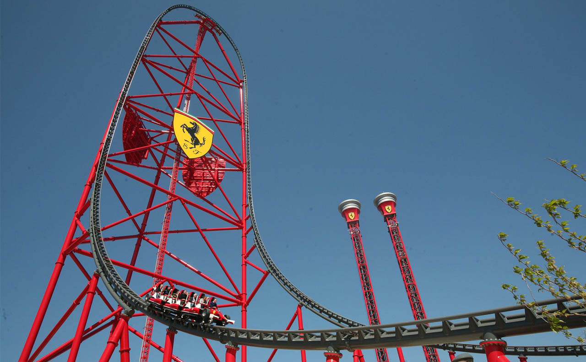

# Easy space

Reducing cost of liftoff and landing operations

Payload to orbit is the most expensive cost per kg in the world.&#x20;

Rocket launch assistant could reduce the fuel to orbit by 40%.

A track angled at 55° to vertical could allow a single stage to orbit reusable vehicle with no new technology.

The Red Force rollercoaster, at the Ferrari Land theme park, is Europe’s tallest taking riders up 112 metres at speeds of 177 km/h
